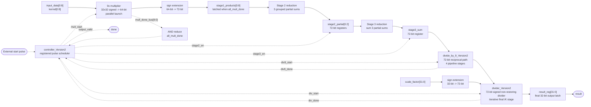
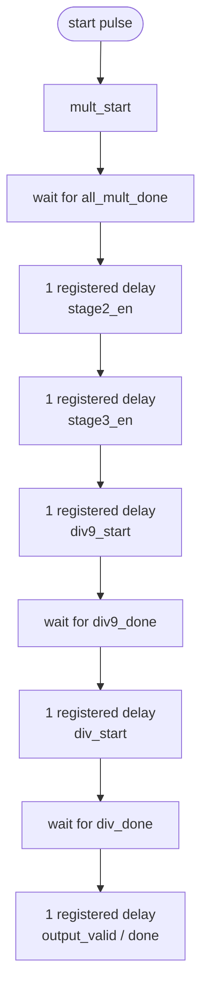
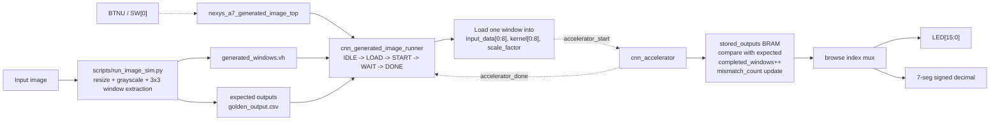
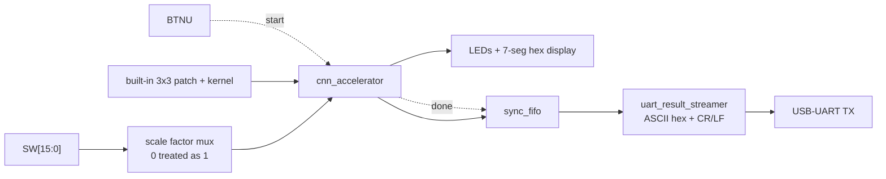

# CNN Architecture Block Diagram

This document describes the current RTL that is actually used by the passing top-level flow in this repository.

Scope:
- Main compute core: `src/cnn_accelerator_Version2.v`
- Main control path: `src/controller_Version2.v`
- Generated-image replay wrapper: `src/cnn_generated_image_runner.v`
- Board wrappers: `board/nexys_a7_top.v` and `board/nexys_a7_generated_image_top.v`

Legend:
- Solid arrows show dataflow.
- Dashed arrows show control or handshake flow.

Important implementation note:
- The current top-level accelerator is not built from chained MAC blocks. It uses 9 parallel multipliers followed by staged reduction, then `/9`, then `/K`.
- `src/MAC.v` is present as a verified standalone arithmetic block for the assignment, but it is not the datapath used inside `cnn_accelerator_Version2`.
- `src/cnn_accelerator_multi_div.v` is an alternate throughput-scaling idea in the repo, but the default passing flow and board demos use `cnn_accelerator_Version2`, so that is the architecture shown below.

## 1. Verified Core Datapath And Control (`cnn_accelerator_Version2`)

### Stage-by-stage meaning

| Step | Datapath work | Stored result | Control event |
|---|---|---|---|
| 1 | Launch 9 signed multiplies in parallel | `mult_product[0:8]` -> `stage1_products[0:8]` | `mult_start`, then `all_mult_done` |
| 2 | Add products in 3 groups | `stage2_partial[0:2]` | `stage2_en` |
| 3 | Add the 3 partial sums | `stage3_sum` | `stage3_en` |
| 4 | Exact signed divide by 9 | `div9_result` | `div9_start` -> `div9_done` |
| 5 | Exact signed divide by `scale_factor` | `final_result` | `div_start` -> `div_done` |
| 6 | Truncate final 72-bit quotient to 32-bit output port | `result_reg` | `output_valid` / `done` |

For the current parameters:
- `NUM_INPUTS = 9`
- `PIPELINE_LANES = 3`
- `GROUP_SIZE = 3`
- Multiply fanout is parallel, but patch launches are still controlled one patch at a time in the verified flow.

## 2. Control Schedule Used By `controller_Version2`

The controller is not a complex FSM with busy/ready handshakes. It is a registered pulse chain that advances the same patch through each stage.

Design implication:
- This is an intra-patch staged datapath, not a fully back-pressured streaming pipeline.
- The safe operating model in the verified flow is: launch one patch, wait for `done`, then launch the next patch.
- That is exactly how `tb/cnn_accelerator_tb_Version2.v` and `src/cnn_generated_image_runner.v` use the accelerator.

Latency note:
- The dominant stage is the final 72-bit divider.
- In practice, the current RTL behaves much closer to a roughly 90-cycle single-patch path than to a short fully overlapped streaming pipeline.

## 3. Generated-Image Replay And Board Flow

This is the higher-level system used when the repo replays a real image that has been preprocessed into 3x3 windows.

Runtime behavior:
- `scripts/run_image_sim.py` creates `generated_windows.vh` plus software-side golden outputs.
- `cnn_generated_image_runner` loads one patch at a time into `cnn_accelerator`.
- When `accelerator_done` arrives, the runner stores the 16-bit displayed result, checks it against the expected value, and either loads the next window or asserts `done`.
- `board/nexys_a7_generated_image_top.v` lets BTN U either start a full replay or browse stored results, depending on `SW[0]`.

## 4. Board Demo Output Path (`nexys_a7_top`)

The simpler board demo path uses a built-in patch and kernel, then queues completed results for UART transmission.

That path is useful for the board demo because:
- the display shows the most recent result immediately
- the FIFO decouples accelerator completion from UART byte-by-byte transmit latency

## 5. Short Summary

If you need one sentence for the project report, this repo currently implements:

> A 3-stage reduction datapath around 9 parallel signed multipliers, followed by a 4-stage divide-by-9 block and a wide iterative final divider, all sequenced by a pulse-based controller and wrapped by board/image replay logic.
